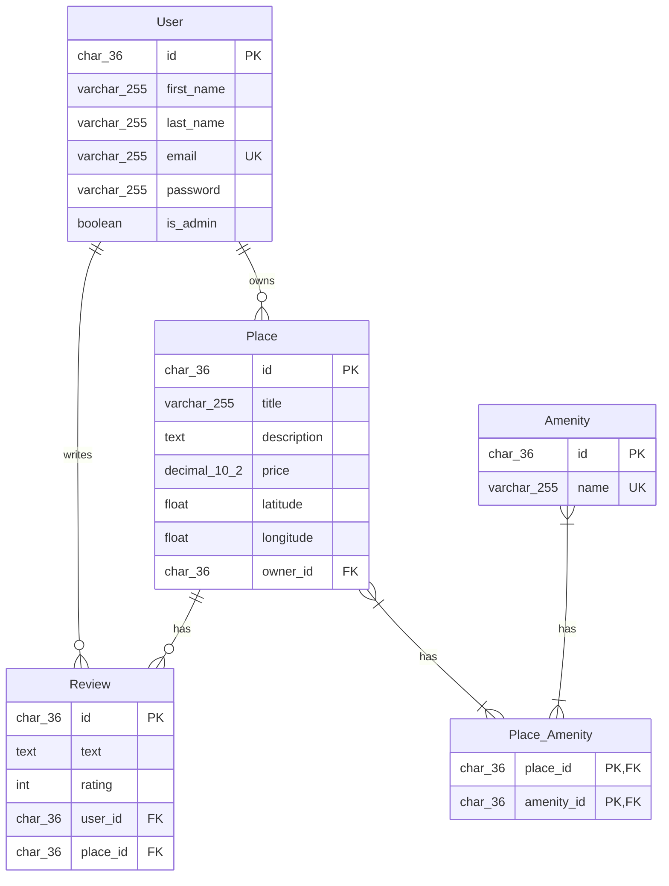

```mermaid
erDiagram
    User ||--o{ Place : owns
    User ||--o{ Review : writes
    Place ||--o{ Review : has
    Place }|--|{ Place_Amenity : has
    Amenity }|--|{ Place_Amenity : has

    User {
        char_36 id PK
        varchar_255 first_name
        varchar_255 last_name
        varchar_255 email UK
        varchar_255 password
        boolean is_admin
    }

    Place {
        char_36 id PK
        varchar_255 title
        text description
        decimal_10_2 price
        float latitude
        float longitude
        char_36 owner_id FK
    }

    Review {
        char_36 id PK
        text text
        int rating
        char_36 user_id FK
        char_36 place_id FK
    }

    Amenity {
        char_36 id PK
        varchar_255 name UK
    }

    Place_Amenity {
        char_36 place_id PK,FK
        char_36 amenity_id PK,FK
    }
```